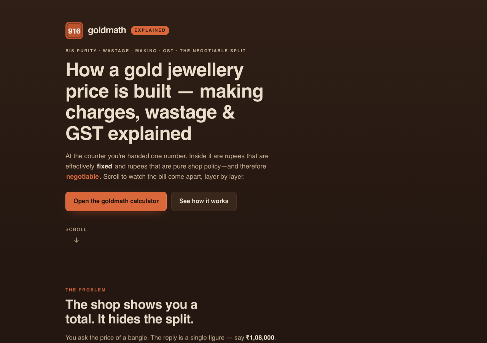

# goldmath — explained

**How a gold jewellery price is built — making charges, wastage & GST, explained with animation.** A single-page, scroll-driven explainer that takes the one number a jeweller hands you and pulls it apart, layer by layer: metal value, wastage, making charges and GST — stamping each as **FIXED** or **NEGOTIABLE** so you can see exactly which rupees can move in a haggle. 100% client-side, zero dependencies, fully offline, tells no one what you're reading about.

**Try the calculator this explains → [goldmath](https://sreenivas-sadhu-prabhakara.github.io/goldmath/)**

## Why

At the counter you're given a single total. Buried inside it are numbers that are effectively **fixed** — the metal value (rate × hallmarked purity × weight) and GST — and numbers that are pure shop policy and therefore **negotiable** — the making charges and wastage. Most people never see the split, so they haggle blind (or not at all).

This page is the picture that makes the split obvious. It's the companion explainer to **goldmath**, the free offline calculator that does the actual arithmetic on your own numbers.

## What's on the page

A short animated narrative, scene by scene:

1. **The problem** — the shop shows you a total and hides the split.
2. **How it comes apart** — the bill rebuilt from a worked example (10 g at 22K **916**, ₹10,000/g board rate, 8% wastage, ₹550/g making, 3% composite GST), each layer stacking up and stamped fixed or negotiable.
3. **The headline** — the fixed/negotiable split bar, with the one negotiable-rupees figure at the top.
4. **The honest number** — why goldmath uses the stamped BIS fineness **916/1000**, not the 22 ÷ 24 = 91.667% shortcut.
5. **The privacy guarantee** — a diagram of `connect-src 'none'`: the page *cannot* phone home, so nothing about what you're pricing can leave your device.
6. **A short feature tour** — verify a bill, buy-back / melt value, compare two shops, the two GST conventions, save & print, cited constants.
7. **A call to action** — open the goldmath calculator and price the real thing.

## Design & accessibility

- **Animation is pure CSS + inline SVG** driven by `IntersectionObserver` — no libraries, nothing loaded from a CDN, CSP-clean.
- **`prefers-reduced-motion` is respected**: every animation degrades to a static, fully legible final state.
- **WCAG-AA in both light and dark**, state is never conveyed by colour alone (fixed = ◆ solid edge; negotiable = ◇ dashed edge), the page is keyboard-operable with visible focus rings and a skip-link.
- **No serif display fonts** — the system sans stack, tabular figures, and one motif (the debossed **916** hallmark punch + the fixed/negotiable split bar) carried through the page, the OG card and the icon, the same family as the goldmath app.

## Quickstart

Just open `index.html` in any modern browser — no build step, no server, no install.

- **Local:** double-click `index.html`, or run a static server in the folder.
- **Hosted:** this explainer is live on GitHub Pages; the calculator it explains is at **[goldmath](https://sreenivas-sadhu-prabhakara.github.io/goldmath/)**.

## Privacy

This is a static page built so it *cannot* leak anything.

- A strict Content-Security-Policy sets `connect-src 'none'`: the page **cannot** make any network request. No fonts, scripts, images or analytics are loaded from anywhere else — everything is same-origin or a `data:` URI.
- There is nothing to save and nothing to track. The linked goldmath calculator keeps any saved quotes in your own browser's local storage.

## Disclaimer

goldmath — explained is an **explainer and negotiation reference, not financial, investment, or tax advice.** The worked figures on the page are illustrative examples, not a quote for any specific ornament. Billing conventions vary by shop, region and state; GST rates change over time — verify the numbers printed on your actual invoice. Hallmarked fineness is a certified *minimum*, so metal value is a slightly conservative estimate, and buy-back/exchange values are shop policy, not law. This software is provided under the MIT License, "as is", without warranty of any kind; the author accepts no liability for any loss arising from its use.

## License

[MIT](./LICENSE) © 2026 Sreenivas Sadhu Prabhakara
